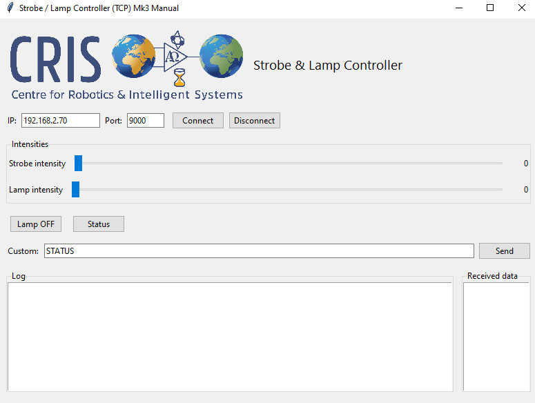

# Strobe & Lamp Controller

A control system built with **Arduino (Nano + ENC28J60 Ethernet shield + MAX485 RS-485 transceiver)** and a **Python Tkinter GUI**.  

- The Arduino exposes a **raw TCP server** (port 9000) where commands can be sent.  
- The Nano forwards commands to a connected RS-485 bus (via MAX485) or simulates local responses.  
- The Python GUI provides a desktop control interface with sliders, buttons, a status check, and a log window.  


---

## Features
- Control **strobe intensity** (0–100)  
- Control **lamp intensity** (0–100)  
- **Lamp ON / Lamp OFF** buttons  
- **Status** button to query the Arduino state (also sent over RS-485)  
- **Custom command** entry to send any raw command  
- All simulated commands also forward to RS-485 as tilde-prefixed messages (e.g. `~Lamp ON`)  
- Direct TCP testing supported (`nc 192.168.2.70 9000`)  

---

## Command Examples

### From GUI or raw TCP:
```
LAMP OFF             → forwarded as ~Lamp OFF
STROBE_INTENSITY 42  → forwarded as ~Strobe INTENSITY 42
LAMP_INTENSITY 80    → forwarded as ~Lamp INTENSITY 80
STATUS               → forwarded as ~Status strobe=42 lamp=80 lamp_on=1
~device set strobe:010|SUBC24991   → forwarded verbatim to RS-485
```

---

## Hardware Requirements
- **Arduino Nano**  
- **ENC28J60 Ethernet shield** (UIPEthernet compatible)  
- **MAX485 RS-485 module** wired as:  
  - Nano **D2 → RE**  
  - Nano **D3 → DE**  
  - Nano **D8 ← RO**  
  - Nano **D9 → DI**  
  - Nano **GND ↔ MAX485 GND**  
  - MAX485 **A/B ↔ USB-RS485 adapter A/B** (to laptop running Termite or another terminal)  
- Common GND between Arduino, MAX485, and adapter  

---

## Software Requirements

### Arduino
- [UIPEthernet library](https://github.com/UIPEthernet/UIPEthernet)  
- `SoftwareSerial` (built-in)  

### Python
- Python 3.8+  
- Tkinter (bundled with Python)  

Install dependencies in a virtual environment:
```bash
python -m venv venv
source venv/bin/activate  # Linux
```

---

## Usage

### 1. Flash the Arduino
1. Open `CurrentArduinoCode.ino` in Arduino IDE.  
2. Select **Arduino Nano**, correct COM port, and upload.  
3. The Nano will print its IP (default `192.168.2.70`) to the Serial Monitor.  

### 2. Run the GUI
```bash
python main.py
```
- Enter the Arduino IP and port (`192.168.2.70 : 9000`)  
- Use sliders and buttons to send commands  
- View responses in the log window  

---

---

## Building a Windows Executable

We packaged the Python Tkinter GUI into a standalone **Windows executable (.exe)** using [PyInstaller](https://pyinstaller.org/).  
This allows the program to run on any Windows machine without needing Python or the source code.

### Steps

1. **Create and activate a virtual environment**
   ```powershell
   py -3 -m venv venv
   venv\Scripts\activate.bat   # (on Windows Command Prompt)
Install required dependencies
2. **Install required dependencies**
   ```powershell
    pip install --upgrade pip
    pip install pyinstaller


2. **Build with PyInstaller From the project root:**
   ```powershell
    pyinstaller --onefile --windowed ^
      --name StrobeGUI ^
      --add-data "cris_logo.png;." ^
      --add-data "Aquorea Mk3 Manual.pdf;." ^
      main.py
    --onefile → bundle everything into a single .exe
    
    --windowed → no console window appears
    
    --add-data → include extra resources (logo and PDF manual)

Find your EXE
The compiled application will be located at:

text
Copy code
dist\StrobeGUI.exe
   
---

## Notes
- The GUI displays a logo (`cris.png`) in the header. Place this file in the same folder as `main.py`.  
- For raw testing, you can connect with `nc 192.168.2.70 9000` or open Termite on your USB-RS485 adapter.  
- Only one TCP client connection is supported at a time.  

---

