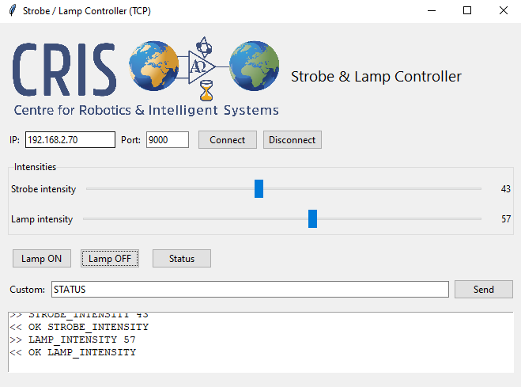

# Strobe & Lamp Controller

A simple control system built with **Arduino (ENC28J60 Ethernet shield)** and a **Python Tkinter GUI**.  
The Arduino exposes a raw TCP server where commands can be sent to control **strobe intensity** and **lamp intensity**, as well as turning the lamp on and off.  

The Python GUI provides a clean interface with sliders, buttons, and a log window for monitoring communication.  



---

## Features
- Control **strobe intensity** (0–100)  
- Control **lamp intensity** (0–100)  
- **Lamp ON / Lamp OFF** buttons  
- **Status** button to query the current state  
- **Custom command** entry to send any raw command  
- TCP-based communication (`nc 192.168.2.70 9000` also works for testing)

---

## Requirements

### Arduino
- Arduino Nano with ENC28J60 Ethernet shield  
- [UIPEthernet library](https://github.com/UIPEthernet/UIPEthernet)  

### Python
- Python 3.8+  
- Tkinter (bundled with Python)  

Install dependencies with:
```bash
python -m venv venv
source venv/bin/activate  # Linux